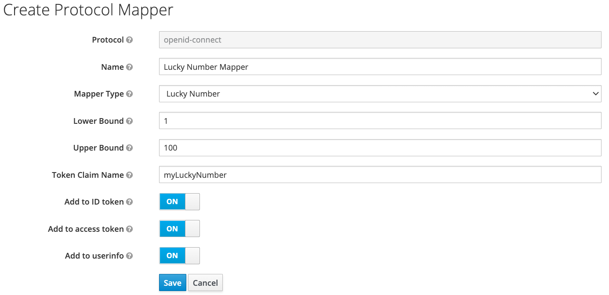

# Keycloak OIDC protocol token mapper

This is an example token mapper for Keycloak using the OIDC protocol.

You can configure the mapper with an upper and a lower bound and it will generate a random lucky number (integer) and maps it into the specified token(s) (and userinfo endpoint) to the specified claim.

## YouTube Video

